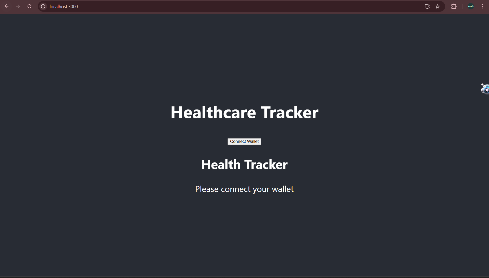

# Healthcare Tracker Frontend

This is a React frontend for interacting with the Soroban **HealthTrackerContract** deployed on Stellar.

---

## ✨ Features

* Connect Freighter Wallet
* Add Health Records (Steps, Calories, Heart Rate)
* Retrieve Health Records by Date
* Built with React + Stellar Soroban

---

## ⚙️ Setup

1. Clone the repository

```
git clone https://github.com/dark-knightcode/healthtracker-stellar.git
cd healthtracker-stellar/frontend
```

2. Install dependencies

```
npm install
```

3. Start the development server

```
npm start
```

The app will run at:

```
http://localhost:3000
```

---

## 🚀 Deploying the Contract

To deploy the Soroban contract:

1. Navigate to the contract directory

```
cd ../healthcare/contracts/hello-world
```

2. Build the WASM

```
make build
```

3. Deploy using Stellar CLI

```
stellar contract deploy \
--wasm target/wasm32v1-none/release/hello_world.wasm \
--network testnet
```

4. Copy the **Contract ID** and paste it into the frontend configuration.

---

## 📸 Application Screenshot

Add screenshots of the UI here.

Example:

```
<!--  -->

```

You can create a folder called **screenshots** and place your UI images inside it.

Example structure:

```
frontend
 ├── screenshots
 │    └── app.png
 ├── src
 └── README.md
```

---

## 👨‍💻 Author

**Paul**

GitHub
https://github.com/dark-knightcode


Email
[paulscode1@gmail.com](mailto:paulscode1@gmail.com)

---

## ⭐ Support

If you like this project, consider giving it a **star ⭐ on GitHub**.

---

## 📚 Learn More

* React Documentation
  https://reactjs.org/

* Create React App Documentation
  https://create-react-app.dev/

* Stellar Soroban Documentation
  https://soroban.stellar.org
